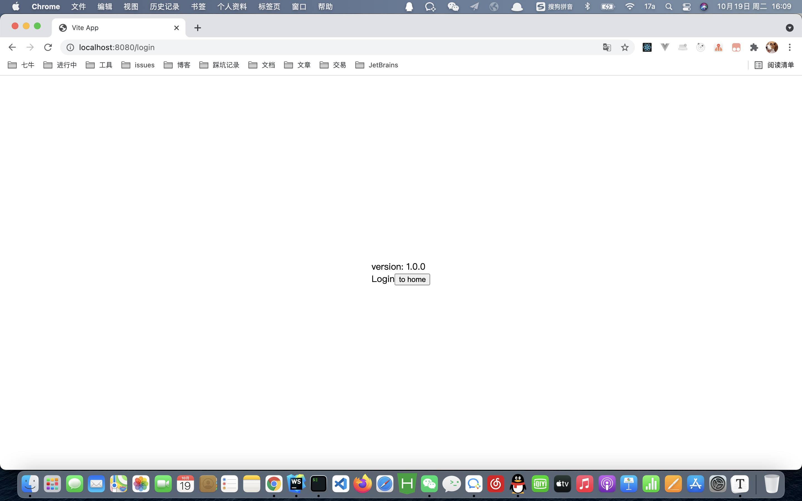
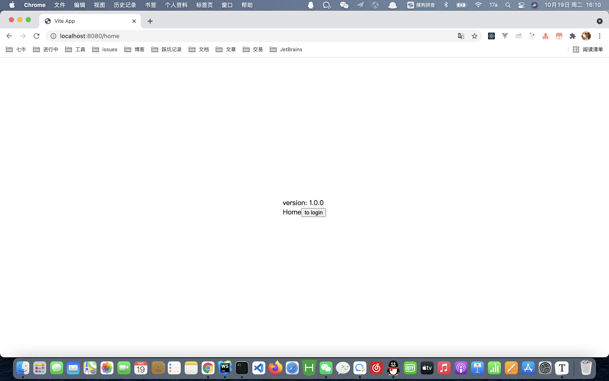
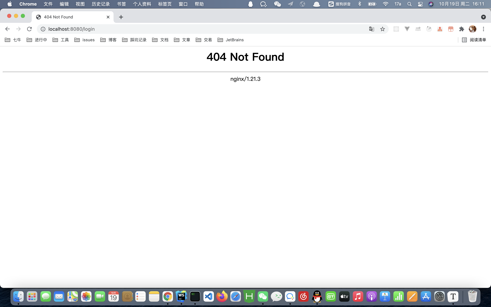

# 需求背景

访问 https://www.xxx.com/1.0.0/ 响应 1.0.0 版本的页面。

访问 https://www.xxx.com/1.0.1/ 响应 1.0.1 版本的页面。

访问 https://www.xxx.com/1.0.2/ 响应 1.0.2 版本的页面。

以此类推...

# History 模式路由

在部署 History 模式路由的页面的时候，我们需要后台配置支持。因为我们的应用是个单页客户端应用，如果后台没有正确的配置，当用户在浏览器直接访问 `http://oursite.com/user/id` 就会返回 404，这就不好看了。

因为这么做以后，你的服务器就不再返回 404 错误页面，因为对于所有路径都会返回 `index.html` 文件。

Nginx 配置如下：

```nginx
location / {
  try_files $uri $uri/ /index.html;
}
```

参考：https://router.vuejs.org/zh/guide/essentials/history-mode.html#%E5%90%8E%E7%AB%AF%E9%85%8D%E7%BD%AE%E4%BE%8B%E5%AD%90

# 编写页面

## src/main.tsx

```tsx
import React from 'react'
import ReactDOM from 'react-dom'
import App from './App'

ReactDOM.render(
  <App />,
  document.getElementById('root')
)
```

## src/App.tsx

```tsx
import { CSSProperties } from 'react'
import IRouter from './IRouter'

const containerStyle: CSSProperties = {
  position: 'absolute',
  left: '50%',
  top: '50%',
  transform: 'translate(-50%, -50%)'
}

const App = () => {
  const version = projectVersion;
  return <div style={containerStyle}>
    <div>version: {version}</div>
    <IRouter />
  </div>
}

export default App;
```

## src/IRouter.tsx

```tsx
import React from 'react'
import { BrowserRouter, Redirect, Route, Switch } from 'react-router-dom'
import Login from './pages/login/login'
import Home from './pages/home/home'

const IRouter = () => {
  const version = projectVersion;
  return <BrowserRouter basename={process.env.NODE_ENV === 'production' ? `/${version}` : '/'}>
    <Switch>
      <Route exact path='/login' component={Login}/>
      <Route exact path='/home' component={Home}/>
      <Redirect to='/login' />
    </Switch>
  </BrowserRouter>
}

export default IRouter
```

## src/pages/home.tsx:

```tsx
// home.tsx
import { useHistory } from 'react-router-dom'

const Home = () => {
  const history = useHistory();
  return <div>
    Home
    <button onClick={() => history.push('/login')}>to login</button>
  </div>
}

export default Home;
```

## src/pages/login.tsx:

```tsx
// login.tsx
import { useHistory } from 'react-router-dom'

const Login = () => {
  const history = useHistory();
  return <div>
    Login
    <button onClick={() => history.push('/home')}>to home</button>
  </div>
}

export default Login;
```

## vite.config.ts

```ts
import { defineConfig } from 'vite'
import react from '@vitejs/plugin-react'

const packageJson = require('./package.json');

console.log('process.env.NODE_ENV', process.env.NODE_ENV)
// https://vitejs.dev/config/
export default defineConfig({
  plugins: [react()],
  define: {
    projectVersion: JSON.stringify(packageJson.version)
  },
  base: './'
})
```

# 基础配置

首先我们先解决部署 History 模式路由

配置如下：

```nginx
location / {
  root   html;
  try_files $uri $uri/ /index.html;
  index  index.html index.htm;
}
```

配置成功，你就可以正常访问页面了，如下图所示：





如果不进行 ``try_files`` 配置的话，刷新页面会得到 404 页面，如下图所示：



# 需求实现

首先实现手动配置版本：

```nginx
location /1.0.0/ {
  root html;
  try_files $uri /1.0.0/index.html;
  index index.html index.htm;
}
location /1.0.1/ {
  root html;
  try_files $uri /1.0.1/index.html;
  index index.html index.htm;
}
location /1.0.2/ {
  root html;
  try_files $uri /1.0.2/index.html;
  index index.html index.htm;
}
```

正则匹配版本：

```nginx
location  ~* /(.*)/ {
  root html;
  try_files $uri /$1/index.html;
  index index.html index.htm;
}
```

测试，访问正常~

# 踩坑记录

最开始配置正则的时候，发现正则是对的，但是一直配置不成功。

后面搜索发现是需要遵循 location 的语法规则的。

Nginx配置中Location的语法规则 `location [ = | ~ | ~* | ^~ | !~ | !~* ] /uri/{ … }`

* = 表示精确匹配
* ~ 表示区分大小写正则匹配
* ~* 表示不区分大小写正则匹配
* ^~ 表示URI以某个常规字符串开头
* !~ 表示区分大小写正则不匹配
* !~* 表示不区分大小写正则不匹配
* / 通用匹配，任何请求都会匹配到

参考文章：https://juejin.cn/post/6844903992871370766

**注：** 其中还需要注意下打包的路径，不然会发生静态资源访问发生错误。

